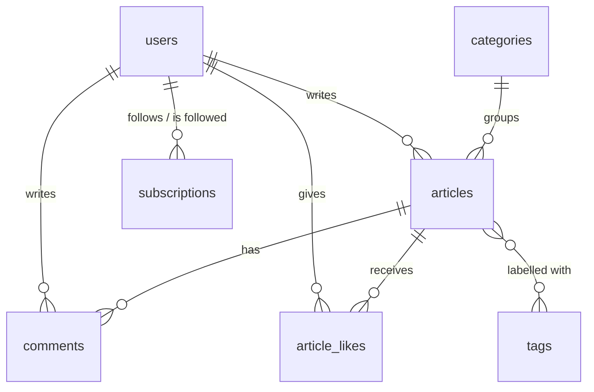

# Database schema

The schema is generated from the JPA entities in
`backend/src/main/java/com/blogplatform/domain/` (`spring.jpa.hibernate.ddl-auto=update`).
This document explains *why* it looks the way it does.

## Diagram

## Tables

### `users`

| Column          | Type          | Notes                                  |
|-----------------|---------------|----------------------------------------|
| `id`            | bigserial PK  |                                        |
| `username`      | varchar(50)   | unique, used in profile URLs           |
| `email`         | varchar(254)  | unique                                 |
| `password_hash` | varchar(100)  | BCrypt hash, never a raw password      |
| `display_name`  | varchar(100)  | optional, falls back to `username`     |
| `bio`           | varchar(1000) | optional                               |
| `avatar_url`    | varchar(255)  | relative URL of the uploaded file      |
| `role`          | varchar(20)   | `USER` / `ADMIN`, stored as a string   |
| `enabled`       | boolean       | lets an account be blocked             |
| `created_at`, `updated_at` | timestamp | filled by JPA auditing      |

The table is called `users`, not `user`, because `user` is a reserved word in
PostgreSQL.

### `articles`

| Column         | Type            | Notes                                    |
|----------------|-----------------|------------------------------------------|
| `id`           | bigserial PK    |                                          |
| `slug`         | varchar(280)    | unique, derived from the title           |
| `title`        | varchar(200)    |                                          |
| `summary`      | varchar(500)    | teaser for feed cards                    |
| `content`      | varchar(100000) | the article body                         |
| `cover_url`    | varchar(255)    | uploaded cover image                     |
| `author_id`    | FK → `users`    | required                                 |
| `category_id`  | FK → `categories` | optional - an article has 0..1 category |
| `status`       | varchar(20)     | `DRAFT` / `PUBLISHED`                    |
| `published_at` | timestamp       | set once, on first publish               |

Indexes: `author_id`, `category_id` and a composite `(status, published_at)` —
the public feed always filters by status and orders by publication date, so one
index serves both halves of that query.

`published_at` is deliberately separate from `created_at`: a draft written in
January and published in March should appear in the feed under March.

### `categories` and `tags`

Both keep a human-readable `name` and a URL-friendly `slug`, each unique.

- A **category** is a single broad topic (`articles.category_id`).
- **Tags** are many-to-many through the join table `article_tags`
  (`article_id`, `tag_id`). Tags are created on demand and shared between
  articles, so renaming a tag renames it everywhere.

### `comments`

Flat list: `article_id`, `author_id`, `content` (≤ 2000 chars) and auditing
timestamps. Indexed by `article_id` (loading one article's comments) and by
`author_id`.

### `article_likes`

A join table with its own id, plus a **unique constraint on
`(article_id, user_id)`**. That constraint — not application code — is what
guarantees a user can like an article only once, even if two requests arrive at
the same moment. Like counts are read with `count(*)`, so there is no
denormalised counter that could drift out of sync.

### `subscriptions`

`follower_id` → `author_id`, with a **unique constraint on the pair**. The
relation is directed: following someone back creates a second row. Both columns
are indexed because both directions are queried — "who follows me" and "whom do
I follow" (the latter feeds the personal timeline).

## Design notes

- **No collections on `User`.** Articles, followers and likes are reached
  through repositories instead of `@OneToMany` fields, so loading a profile
  never pulls in the user's whole blog.
- **All `@ManyToOne` associations are `LAZY`.** Where a page genuinely needs the
  related rows, the repository asks for them explicitly with `@EntityGraph`,
  which keeps the query count predictable instead of accidental.
- **Enums are stored as strings** (`@Enumerated(EnumType.STRING)`), so the data
  stays readable and reordering the Java enum cannot corrupt existing rows.
- **Deleting an article** removes its comments and likes first, in the service
  layer, rather than relying on JPA cascades that would load every child row
  into memory.
